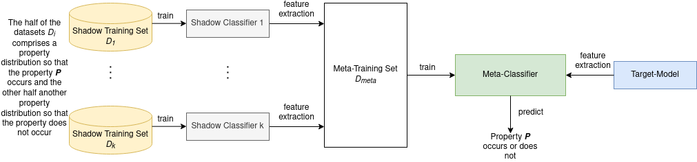

# Privacy Evaluator
[](https://www.python.org/downloads/release/python-370/)
[](https://github.com/psf/black)
[](https://opensource.org/licenses/MIT)
[](https://gitter.im/privML/community?utm_source=badge&utm_medium=badge&utm_campaign=pr-badge)


The *privML Privacy Evaluator* is a tool that assesses a ML model's levels of privacy by running different privacy attacks on it. The tool builds upon the [Adversarial Robustness Toolbox (ART)](https://github.com/Trusted-AI/adversarial-robustness-toolbox) and aims at extending it by implementing additional privacy attacks as well as providing easy-to-use Jupyter Notebooks which offer understandable output metrics even for non-ML experts.

Developers and anyone else with a PyTorch or TensorFlow neural network model at hand can use `privacy-evaluator` to evaluate their model's susceptibility to *model inversion attacks*, *membership inference attacks* and *property inference attacks*. Details on how to use this tool can be found in this README. 

## Dependencies

- [Python 3.7](https://www.python.org/)
- [Adversarial Robustness Toolbox (ART) 1.6.1](https://github.com/Trusted-AI/adversarial-robustness-toolbox)
- [PyTorch](https://pytorch.org/)
- [TensorFlow v2](https://www.tensorflow.org/)
- for detailed list see [setup.py](setup.py) 

## Installation

### Production

To install the `privacy-evaluator` package for production purposes please, follow the subsequent instructions. All instructions also work for Python's and Anaconda's virtual environments.

If you want to use `git clone` together with `pip`, you can run:

```
git clone https://github.com/privML/privacy-evaluator.git
cd privacy-evaluator
```

Optionally, If you want to install a specific branch, please check out the wanted branch first:

```
git checkout <branch-name>
```

Then install the package:

```
pip install .
```

If you want to use `pip` only, you can run:

```
pip install git+https://github.com/privML/privacy-evaluator
```

Optionally, If you want to install a specific branch, please run the following command:

```
pip install git+https://github.com/privML/privacy-evaluator@<branch-name>
```

### Development

To install the `privacy-evaluator` package for development purposes please, follow the subsequent instructions.

If you want to use `git clone` together with `pip`, you can run:

```
git clone https://github.com/privML/privacy-evaluator.git
cd privacy-evaluator
```

Optionally, If you want to install a specific branch, please check out the wanted branch first:

```
git checkout <branch-name> 
```

Then install the package:

```
pip install -e .[development]
```

## How to use the Privacy Evaluator?

Check out our [/notebooks](/notebooks), all usages are descibed there. 

## Attacks

### Property Inference Attack


The Property Inference Attack aims to detect patterns in the parameters of the target model including properties 
which the model producer has not intended to reveal. Therefore, adversaries require a 
meta-classifier which predicts one of these properties they are interested in. 

The first step of the attack is to generate a set containing k datasets on which k shadow classifiers are trained. These shadow classifiers then constitute the training datset on which a meta classifier is trained. The k datasets should be drawn from a pool of data that is as similar as possible to the original dataset on which the target model was trained. If the original dataset is known, the shadow datasets could be created by sampling from that dataset. Furthermore, it is crucial that one half of the shadow classifiers 
is trained with a dataset including the property P and one half including not P (¬P). In addition, 
each shadow classifier comprises the same architecture as the target model where each is only fitted by its 
corresponding dataset. They do not need to perform as good as the target model, but demonstrate passably acceptable 
performance.
Because the parameters in neural networks are usually randomly initialized and even after training, the order of 
parameters is arbitrary. Thus, the meta classifier must be trained on this so that it is able to recognize pattern between 
the parameters of the shadow classifiers. As a result, all the parameters of each shadow classifier represent the 
feature representation F<sub>k</sub>. The feature representation form together the training set for the meta classifier 
where each is labeled correspondingly as either P or ¬P. The training algorithm for the meta-classifier can 
be arbitrarily chosen.

### Membership Inference Attack

The aim of a membership inference attack is to find whether a sample given to a trained machine learning model was part of its training data or not, which can lead to a breach of privacy. Specifically, a privacy breach in that regard consists of inferring values of unintended (sensitive) attributes used as input to a model, allowing assumptions about the members of a population as well as specific members that were used to train a model.

For example, knowing that a certain data record was used to train a model which yields a certain type of labels, reveals about the origin of that data record that it correlates to some label of the model. In the case of a model trained to identify cancer types of patients, it can be revealed that the person whose record was used has indeed some type of cancer.

Given here are three types of membership inference attacks, all able to work with the assumption of having only black-box access to a given target model, meaning no prior knowledge about the to-be-attacked models is needed. However, to perform each of the attacks, it is necessary to have access to, or be able to generate, samples from the same or a related data distribution beforehand.  In case of having to generate such data, please refer to Section V-C of  [Shokri et al.]([https://arxiv.org/abs/1610.05820](https://arxiv.org/abs/1610.05820)) for a couple of methods for doing so.

All three attacks are generic and not based on any particular dataset or model type.

For a tutorial to each of the following attacks have a look at the collection of notebooks [here](/notebooks).

#### Membership Inference Back-Box

This is the implementation of the original idea of a black-box membership inference attack as provided by [Shokri et al.](https://arxiv.org/abs/1610.05820). It aims to abuse the abnormal confidence of a target model when queried on their training data to differentiate between members and non-members of a model’s training set. The confidence is a vector of probabilities, the confidence values, one value per class, estimating the likelihood of a given input data record belonging to a certain class.

Provided a model, the target model (trained on an unknown labeled set of data _(X,y)<sub>target</sub>_), and a separate labeled set of data _(X,y)<sub>attack</sub>_, which can be derived via various methods and which is preferably most similar to the one that the target model was trained on, the original attack trains a binary meta-classifier, using _(X,y)<sub>attack</sub>_ in conjunction with a multitude of so-called shadow models, and uses the meta-classifier to decide whether or not a data point was part of the target model’s training set or not. 

In the original attack, the separate, labeled set of data _(X,y)<sub>attack</sub>_ is meant to be drawn from the same distribution as _(X,y)<sub>target</sub>_, and utilizes the training of shadow models on (disjunct and possibly overlapping) partitions of _(X,y)<sub>attack</sub>_, each imitating the behaviour of the target model, whilst knowing the “ground truth” for each shadow model. Using the shadow models to classify a data point that was not part of _(X,y)<sub>target</sub>_, and comparing the “unseen data confidence” of the shadow models with the one of the target model, the attack is able to recognize the occurrence of abnormal confidence values in the target model, indicating when a data point was part of the data that the target model was trained on.

The implementation provided here uses ARTs Blackbox MIA, which assumes what was originally done via shadow models to be done external and a priori, as recent research has shown that both, the requirement of having data from the same distribution as _(X,y)<sub>target</sub>_ and the usage of shadow models at all can be relaxed. Instead, the target model itself can be used to generate a set _(X,y)<sub>target</sub>_ ([Salem et al.](https://arxiv.org/abs/1806.01246)), which is then used in this implementation.

Once the meta-classifier is trained, it can be used to infer membership status on an array of one or more unknown unlabeled data records _X<sub>unkown</sub>_, returning for each record either  a 1, indicating a member, or a 0, indicating a non-member of the target model’s training set _(X,y)<sub>target</sub>_.

The current implementation gives the user the choice of the attack model meta-classifier. The default is a neural network, but random forests and gradient boosting models can be chosen as well.

For a better understanding, the following two graphics visualize the functionality of the attack. The first one, the table, summarizes the purpose of each model and which dataset it is associated with. The second one visualizes the attack flow.

| Model | Purpose and Dataset |
|:-------------:|:-------------:|
| target model | this model was trained on an unknown dataset (X,y)<sub>target</sub> of which members are to be infered via the attack |
| attack model | this model is used to attack the target model and is trained on a datset (X,y)<sub>attack</sub> which should preferably be as similar as possible to (X,y)<sub>target</sub> |


#### Membership Inference Back-Box Label-Only - Decision Boundary

This is the implementation of the original idea of a black-box membership inference Label-Only attack as provided by [Choquette-Choo et al.](https://arxiv.org/abs/2007.14321). Instead of relying on the abuse of a target model’s confidence when queried with their training data, this attack utilizes data augmentations and adversarial examples to obtain a fine-grained membership signal to differentiate between members and non-members of a model’s training set.

Provided a model, the target model (trained on an unknown labeled set of data _(X,y)<sub>target</sub>_), and a separate labeled set of data _(X,y)<sub>attack</sub>_, preferably most similar to the one that the target model was trained on, this attack uses several iterations of data augmentation to generate abbreviations for each point. For example, by iteratively augmenting each point (x, y<sub>true</sub>) of _(X,y)<sub>attack</sub>_, additional points _{x’<sub>1</sub>, …, x’<sub>N</sub>}_ are generated. By querying the target model _h_ with all generated data records (including the original ones _(x, y<sub>true</sub>)_) the labels _(y<sub>0</sub>, …, y<sub>N</sub>) ← (h(x), h(x’<sub>1</sub>), …, h(x’<sub>N</sub>))_ are obtained, yielding a function _b<sub>i</sub> ← (y<sub>true</sub> = (y<sub>i</sub>))_, which indicates whether a i-th queried generated point was misclassified. Afterwards, a prediction model _f(b<sub>0</sub>, …, b<sub>N</sub>) → {0, 1}_ is applied and used, by the means of transfer learning, to train a shadow model _h’_. _h’_, and its inherent correlation between the amount of iterations of data augmentations needed and the likelihood of a data record being a member of the training set of _h_, is then being used to infer membership of any data record in respect to the training set of _h_.

Once the shadow model is trained, it can be used to infer membership status on an array of one or more unknown unlabeled data records _X<sub>unkown</sub>_, returning for each record either  a 1, indicating a member, or a 0, indicating a non-member of the target model’s training set _(X,y)<sub>target</sub>_

For a better understanding, the following two graphics visualize the functionality of the attack. The first one, the table, summarizes the purpose of each model and which dataset it is associated with. The second one visualizes the attack flow.

| Model | Purpose and Dataset |
|:-------------:|:-------------:|
| target model | this model was trained on an unknown dataset (X,y)<sub>target</sub> of which members are to be infered via the attack |
| attack model | this model is used to attack the target model and is trained on a dataset (X,y)<sub>attack</sub> which should preferably be as similar as possible to (X,y)<sub>target</sub> |


#### Membership Inference Black-Box Rule-Based

The attack uses a simple rule: if the target model’s prediction for a given input is correct then that input is considered to be a member of the population underlying the target model’s dataset and not a member otherwise.

Provided a model, the target model (trained on an unknown labeled set of data _(X,y)<sub>target</sub>_), and a separate labeled set of data _(X,y)<sub>unkown</sub>_, this attack iterates over each labeled data record of _(X,y)<sub>unkown</sub>_, returning for each record either  a 1, if classified correctly by the target model, indicating a member of the population of _(X,y)<sub>target</sub>_, or a 0, if classified incorrectly by the target model, indicating a non-member of the population of _(X,y)<sub>target</sub>_.

For a better understanding, the following two graphics visualize the functionality of the attack. The first one, the table, summarizes the purpose of each model and which dataset it is associated with. The second one visualizes the attack flow.

| Model | Purpose and Dataset |
|:-------------:|:-------------:|
| target model | this model was trained on an unknown dataset (X,y)<sub>target</sub> of which members are to be inferred via the attack |
| attack model | no attack model is used for this attack, as records of (X,y)<sub>unkown</sub> are inferred as member/non-member of (X,y)<sub>target</sub> based on the target model's classification correctness |


#### Membership Inference Attack on Point Basis (Privacy Risk Score)

This is the implementation of the original idea of a Membership Inference Attack on Point Basis provided by *Systematic Evaluation of Privacy Risks of Machine Learning Models*  [(arXiv:2003.10595)](https://arxiv.org/abs/2003.10595) described there as Privacy Risk Score. The attack performs an empirical measurement of the posterior probability that a singular datapoint of _(X,y)<sub>target</sub>_ or _(X,y)<sub>non-target</sub>_ is from the training set, observing the target model's behavior over that sample. A Privacy Risk Score for a given sample of zero means that it's probability of being a member is estimated to be zero. 

The calculation of the Privacy Risk Score is based on Bayesian Principles and needs both a _(X,y)<sub>target</sub>_ and _(X,y)<sub>non-target</sub>_ dataset in order to work properly.  _(X,y)<sub>non-target</sub>_ is a dataset that was not used to train the target model. For the details of the calculation see the paper linked above.

| Model | Purpose and Dataset |
|:-------------:|:-------------:|
| target model | this model was trained on an dataset (X,y)<sub>target</sub> and is used to calculate the privacy risk scores |
| attack model | no attack model is used for this attack, as a privacy risk score is calculated based on the target model's behaviour with respect to both dataset _(X,y)<sub>target</sub>_ and _(X,y)<sub>non-target</sub>_ |

#### Membership Attacker's Advantage Score

This metric represents the attacker's advantage score, which is the degree to which a learning algorithm, i.e. a model, reveals membership to an adversary. The score calculation is based on Definition 4 from [Yeom, Samuel, et al.](https://arxiv.org/pdf/1709.01604.pdf).

Basically, the membership advantage _Adv<sup>M</sup>_ expresses the difference between an adversaries true-positive and false-positive rates:
<p align="center">
<em>Adv<sup>M</sup> = Pr[A = 0 | b = 0] - Pr[A = 0 | b = 1]</em>,
</p>
where A is the adversary choosing from {0,1} and b choosing uniformly at random from {0,1}.

## Getting Involved
If you want to contribute in any way, please visit our [Contribution Guidelines](./CONTRIBUTING.md) to get started. Please have also a look at our [Code of Conduct](./CODE_OF_CONDUCT.md). 

### Contact
Gitter: https://gitter.im/privML/community
You can join our [Gitter](https://gitter.im/privML/community) communication channel.

### Who is behind the project?
See a list of our [Supporters](./SUPPORTER_LIST.md).


## License
This library is available under the [MIT License](https://github.com/git/git-scm.com/blob/master/MIT-LICENSE.txt).

## References
Ganju, Karan, Qi Wang, Wei Yang, Carl A. Gunter, und Nikita Borisov. „Property Inference Attacks on Fully Connected Neural Networks Using Permutation Invariant Representations“. In Proceedings of the 2018 ACM SIGSAC Conference on Computer and Communications Security, 619–33. Toronto Canada: ACM, 2018. https://doi.org/10.1145/3243734.3243834.

