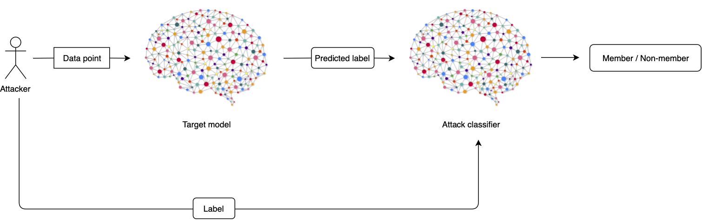

# privacy-evaluator

The privML Privacy Evaluator is a tool that assesses ML model's levels of privacy by running different attacks on it.

## How does it work?

### Membership Inference Attack

Privacy in the context of machine learning is concerned with two types of privacy breaches.
The first being a privacy breach in regards to the population from which a set of data is drawn from. As each valid model aims to make generalizations on inputs that were not part of their training set, it inherently comes with correlations, as well as inferences enabled by them, that hold for the entire population. A privacy breach in that area consists of inferring values of unintended (sensitive) attributes used as input to a model, which hold for an arbitrary member of the population. This type of privacy breach aims to make assumptions about the members of a population.

The second being a privacy breach in regards to the actual members themselves whose data was used to train a model. Despite being members of a population too, hence allowing them to be used to infer information about the entire population, this breach aims to reveal information about the specific data records used to train a model, beyond what it reveals about arbitrary members of a population. This type of privacy breach aims to find out the members used as part of a training set as part of the training of a model.

The attacks provided here are motivated by both of these types of breaches and can be used to quantify membership information leakage in regards to inferring information about members of the population as well as the members of training data through the prediction outputs of a machine learning model.

To quantifiably measure the membership inference attack, two metrics are used:

‘Precision’ describes the fraction of records inferred as members that are indeed members of the training set.

‘Recall’ describes the fraction of the training dataset’s members that are correctly inferred as members of the training set by an attacker.

The following inference techniques are generic and not based on any particular dataset or model type.

#### Membership Inference Back-Box Attack

This is the implementation of the initial idea of a black-box membership inference attack as provided by [Shokri et al.](https://arxiv.org/abs/1610.05820).

This attack is motivated by the protection of the privacy of the individuals whose data was used to train a model. Specifically, the attack provided here aims to investigate what data records were used to train a model.

In this setting, a membership inference attack on a target model consists of an adversarial using machine learning to train an inference model which is subsequently used to recognize differences in the target model’s predictions on the inputs that it trained on versus the inputs that it did not train on.
Determining whether a given data record was part of a model’s training data set or not is an indication of information leakage through the model, which can directly lead to a privacy breach. For example, knowing that a certain data record was used to train a model which yields a certain type of labels, reveals about the origin of that data record that it correlates to some label of the model. In the case of a model trained to identify cancer types of patients, it can be revealed that the person whose record was used has indeed some type of cancer.

Assuming that an attacker has query access to a model, knows the format of the inputs and the outputs of the model, including number and range of their values and can obtain the models prediction vector on any data record, a membership inference attack in the black-box scenario, the most difficult setting, is as follows.
Given a data record and black-box query access to the target model, an attack succeeds if the attacker can correctly determine whether the data record was part of the model's training data set or not.

This attack queries a target model with a data record and obtains a model’s prediction on that record - the model’s structure or meta-parameters are not known a priori at all. Given any input data record, a model outputs the prediction vector of probabilities, one probability value per class, estimating the likelihood of the given input data record belonging to a certain class. The probabilities in this vector are also referred to as the confidence values. The class with the highest calculated confidence value is considered to be the predicted label for the data record.

This attack exploits the observation that machine learning models are prone to behaving differently on data that they’ve been trained on versus data that was not used in the training process, which is reflected in the confidence values generated for a given input data record. Often mentioned in conjunction with the train-test gap, this phenomenon is strongly related to the overfitting of a model for the most part, and slightly less to the general structure of a model.
This attack’s objective is to construct an attack model which is capable of recognizing such differences in the target model’s behaviour and using them to decide whether a given data record was present as a member of the target model’s training dataset or not.

The vector of probabilities along with the label for the input is passed to the attack model (a binary classifier) which decides whether the input was part of the training set or not. To enable the attack model to distinguish members from non-members of the target model’s training set, the attacker must first utilize a so-called shadow training technique which aims to train the attack model on proxy targets by generating training data for the attack model that is similarly distributed to the target model’s training data. These so-called shadow training datasets can be generated using model-based synthesis, statistic-based synthesis or noisy real data. For details the generation of such data, please refer to Section V-C of  [Shokri et al.](https://arxiv.org/abs/1610.05820).

The current implementation gives the user the choice of the attack model classifier. The default model is a neural network, but a random forest and gradient boosting models can be chosen as well.

Important to note is that this attack performs faster on specifically larger datasets than its brother, the Label-Only Membership Inference attack (see next attack), which in return offers robustness against privacy defense mechanisms that modify a model's output (confidence values) in order to thwart attacks.
In general, this attack should be the preferred one, and in case of bad Precision and Recall values, the Label-Only-based membership inference attack should be applied.

#### Membership Inference Back-Box Label-Only Attack - Decision Boundary

This is the implementation of the initial idea of a black-box membership inference Label-Only attack as provided by [Choquette-Choo et al.](https://arxiv.org/abs/2007.14321).

The attack is also motivated by the protection of the privacy of the individuals whose data was used to train a model. Specifically, the attack provided here aims to investigate what data records were used to train a model, judging not by confidence values, but instead by using model outputs in the shape of labels only.

This is a black-box membership attack which only requires a predicted label as the output of the target model and not a vector of probabilities. This fact makes the attack much more general and applicable to the cases where the attacker does not have access to the output probabilities of the black-box model.

This attack performs on par with attacks that require access to model confidences as shown in its reference paper.

If the above confidence-based membership inference attack seems to perform poorly, it might be advisable to use this very attack here, as so called confidence-masking mechanism might be existent.

#### Membership Inference Black-Box Rule-Based Attack

This attack is motivated by the protection of the privacy of the population from which a set of data is drawn from. Although the nature of a valid model is based on statistical facts about the population, hence making it difficult to protect against population privacy breaches, this attack aims to help demonstrate a model’s weakness in regards to population membership inference.

Similar to the other two membership attacks, this attack works in the black-box setting and only makes observations based on the outputs of the target model for given inputs.

In contrast to the black-box models above, which involve training an attack classifier, this attack is much simpler. The attack uses a simple rule: if the target model’s prediction for a given input is correct then that input is considered to be a member of the population underlying the target model’s dataset and not a member otherwise.

## How to use the Privacy Evaluator?

## How to contribute to the project?
If you want to contribute in any way, please visit our [Contribution Guidelines](https://github.com/privML/privacy-evaluator/CONTRIBUTING.md) to get started.

## Communication

### Who is behind the project?
See a list of our [Supporters]().

### Contact
Gitter: https://gitter.im/privML/community

## License
This library is available under the [MIT License](https://github.com/git/git-scm.com/blob/master/MIT-LICENSE.txt).

## References
